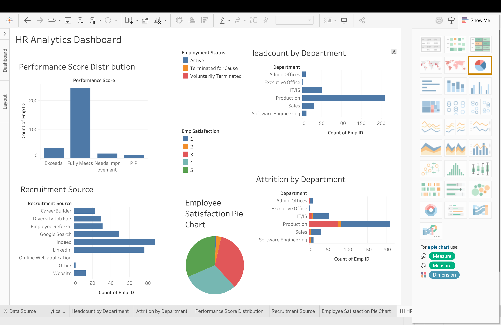

# HR Analytics Dashboard

An end-to-end HR analytics project on the **Human Resources Data Set** — covering data cleaning, exploratory analysis, SQL querying, and an interactive Tableau dashboard.

## Tools Used
- **Python** (Pandas, Matplotlib, Seaborn) — data cleaning & EDA
- **SQL** (MySQL/PostgreSQL) — business analysis queries
- **Tableau** — interactive dashboard

## Project Structure
```
├── HRDataset_v14.csv                  # Raw dataset
├── hr_cleaned.csv                     # Cleaned dataset (output of Python script)
├── 01_hr_clean_and_eda.py             # Data cleaning + EDA script
├── 02_hr_sql_analysis.sql             # SQL schema + 10 business queries
├── charts/                             # EDA chart outputs (PNG)
└── dashboard_screenshot.png            # Final Tableau dashboard
```

## Key Insights

- **Headcount**: 311 employees total — 207 Active (67%), 104 Terminated (33%).
- **Department size vs attrition**: Production is both the largest department (209 employees) and has the highest attrition rate (39.7%), making it a key area for retention focus.
- **Performance**: The majority of employees (243) fall into the "Fully Meets" performance category; only 13 are on a Performance Improvement Plan (PIP).
- **Recruitment sources**: Indeed and LinkedIn are the top two channels by hire volume.
- **Compensation**: Executive Office has the highest average salary, while Production has the lowest.
- **Diversity**: The workforce is 57% female, 43% male, with Single (137) and Married (124) as the most common marital statuses.
- **Satisfaction**: Most employees report satisfaction scores of 3-5, suggesting generally positive engagement despite Production's higher attrition.

## Dashboard

The final Tableau dashboard combines five views:
1. **Headcount by Department** — employee count per department
2. **Attrition by Department** — active vs. terminated breakdown, stacked by department
3. **Performance Score Distribution** — count of employees per performance category
4. **Recruitment Source** — hires by recruitment channel
5. **Employee Satisfaction** — pie chart of satisfaction scores (1-5)



## How to Reproduce

1. Run `01_hr_clean_and_eda.py` to clean the raw data and generate EDA charts:
   ```
   pip install pandas matplotlib seaborn
   python3 01_hr_clean_and_eda.py
   ```
2. Load `hr_cleaned.csv` into a SQL database and run the queries in `02_hr_sql_analysis.sql`.
3. Open `hr_cleaned.csv` in Tableau to rebuild the dashboard, or view the included screenshot.

## Data Source

Human Resources Data Set (HRDataset_v14) by Dr. Rich Huebner.
